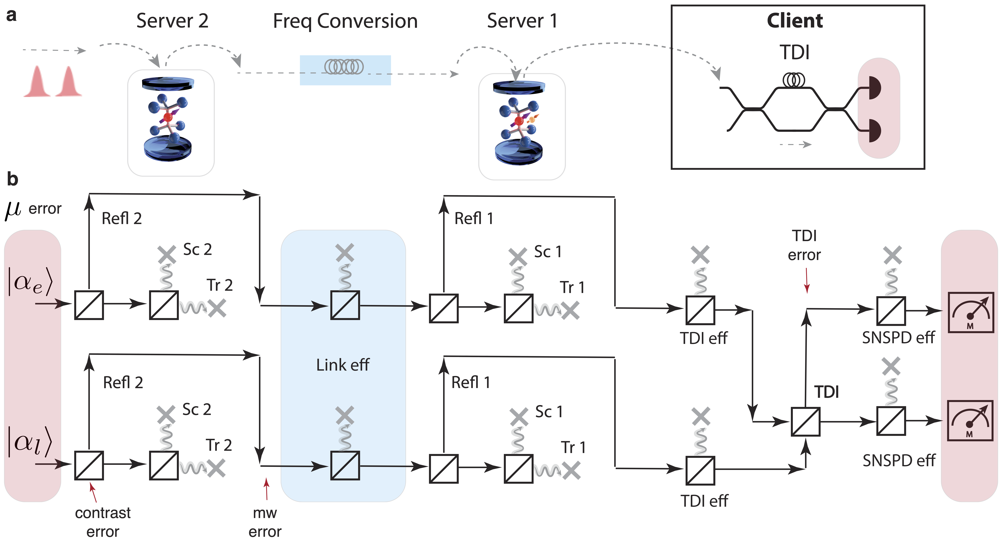
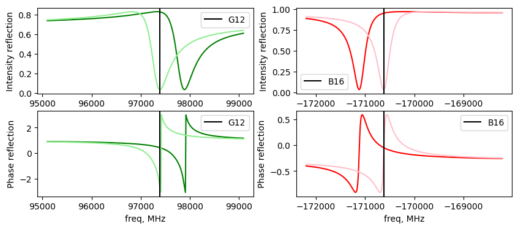
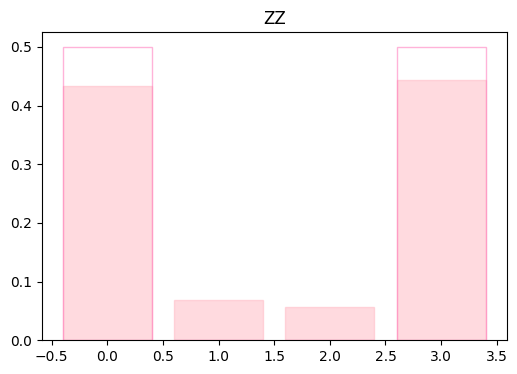
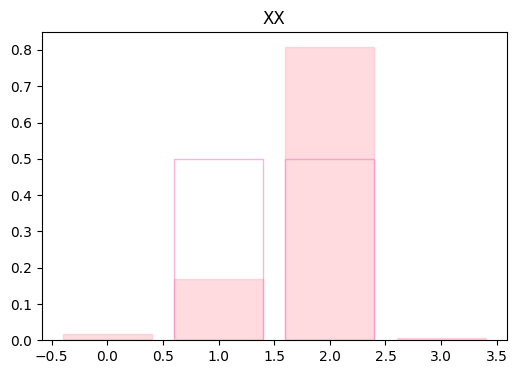
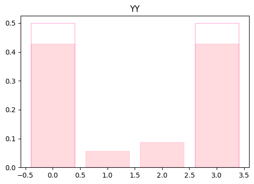
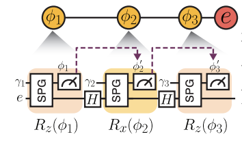

# Quantum Network Simulation Package



A Python-based simulation package designed for modeling quantum networking experiments as a sequence of beam splitter operators. Originally developed to simulate experiments for the Silicon-Vacancy (SiV) team.

## Overview

This simulation toolkit enables the simulation of entanglement-based experiments for various multi-node quantum network topologies. It is designed for cavity-QED nodes with reflection-based gates using weak coherent sources as photonic time-bins to build qubits and qudits. Each interaction step along the path of the time-bin is encoded as a beam splitter Hamiltonian, which is valid in our case since the number of excitations is less than 1. The toolkit provides tools for simulating quantum state propagation through optical fiber networks and analyzing the resulting quantum states.

[](https://doi.org/10.5281/zenodo.14776224)


## Features

- Beam-splitter operator based network simulation
- Support for Silicon-Vacancy center experiments
- Quantum state propagation calculations
- Network topology configuration
- Blind quantum computing simulations
- Serial and parallel entanglement protocols using photonic qubits and qudits (e.g., d = 4)

## Installation

### Prerequisites

- Python 3.7 or higher
- Git

### Dependencies

The following Python packages are required:
- NumPy: For numerical computations
- SciPy: For scientific computations and optimization
- QuTiP: For quantum mechanics calculations
- NetworkX: For network topology handling
- Matplotlib: For visualization
- h5py: For data storage
- pandas: For data manipulation
- tqdm: For progress bars

### Setup Instructions

1. Clone the repository:

```bash
git clone https://github.com/AzizaSuleyman/simnet
```

2. Navigate to the project directory:

```bash
cd simnet
```

3. Install dependencies:

```bash
pip install -r requirements.txt
```

## Project Structure

### SimulationCode Directory

The `SimulationCode` directory contains the core simulation components:

#### fiber_network.py
- defines the network geometry
- specifies all of the losses in the network: fiber coupling, frequency conversion, fiber loss, detection loss
- specify if entanglement geometry is parallel vs serial (the default)

#### SiVnodes.py
- Silicon-Vacancy center class 
- Defines the cavity-QED parameters for SiV-cavity system
- Optimum SiV-Cavity detuning for hgherst contrast
- Change and set contrast
- Defines complex reflectivity of the cavity-SiV system at a function of optical frequency

#### SiVgates.py
- Contains a myriads of frequently used functions 
- State tomography
- Microwave and RF gates
- Photon loss
- Beam splitter operator definition

#### BlindGatesSimulation.py
- Contains the Blind quantum computing class 
- All of the function used to simulate Blind gates in our exeriment

#### Plots.py
- Visualization utilities
- Data plotting functions
- Analysis result presentation

## Usage Examples

### Serial two-node entanglement

```bash
import matplotlib.pyplot as plt
from matplotlib import colors
import numpy as np
import qutip as qt
import sys
sys.path.append('../SimulationCode/')
from TelescopeSimulation import *
from fiber_network import FiberNetwork
from SiVnodes import SiV
from SiVgates import *
from Plots import *

```

Setup two SiVs

```bash
#Server A
siv_a = SiV(kappa_in= (74.9 - 54.5)*(10**3), kappa_w= (54.5)*(10**3), g=5.6*(10**3), wCav = (0)*(10**3), 
             wSiv = -(479.8 -639.6)*(10**3), dwEl = 0.5*(10**3))
#Server B
siv_b = SiV(kappa_in= (43.5 - 26.0)*(10**3), kappa_w= (26.0)*(10**3), g=8.5*(10**3), wCav = (0)*(10**3), 
             wSiv = -(804.9 -657.6)*(10**3), dwEl = -0.5*(10**3))
```

Setup a serial two-node network

```bash

# Create Networks:
g12_b16_network = FiberNetwork(siv_a, siv_b) # this device is now in B16 fridge

# Create Simulation:
sim2 = TelescopeSimulation(g12_b16_network)

# Setup efficiencies

g12_b16_network.fibercoupling_eff = 0.6
g12_b16_network.tdi_eff = 0.35*0.3
g12_b16_network.snspd_eff = 0.9
g12_b16_network.detection_eff
g12_b16_network.detection_eff_reset()
g12_b16_network.link_efficiency = (g12_b16_network.fibercoupling_eff**2)*0.05*0.64

print('Detection efficientvy is = ', g12_b16_network.detection_eff)
print('Link efficientvy is = ', g12_b16_network.link_efficiency)

```

Set some error sources

```bash

# gate fidelities

b16_mwfid = 0.99
g12_mwfid = 0.98

# Move SiVs to the desired contrast

b16_contrast = 25 # range 18 - 30
g12_contrast = 20 # range 12 - 20

siv_b.set_contrast(b16_contrast)
actual_contrast_b16 = siv_b.get_best_contrast()
print("B16 contrast is set to = ", actual_contrast_b16)

siv_a.set_contrast(g12_contrast)
actual_contrast_g12 = siv_a.get_best_contrast()
print("G12 contrast is set to = ", actual_contrast_g12)

```

Plot actual reflectivites of Siv-cavity systems in each node as a function of frequency of light

```bash

## Plot 
# generate plots of reflectivity

wl_A = siv_a.get_plotaxis()
wl_B = siv_b.get_plotaxis()

wl_read_optimum_A = siv_a.freq_optimum()
wl_read_optimum_B = siv_b.freq_optimum()


figure, ax = plt.subplots(2, 2, figsize=(10, 4))

ax[0,0].plot(wl_A, np.abs(siv_a.cav_refl(wl_A)['refl_refl'])**2, color = 'green')
ax[0,0].plot(wl_A, np.abs(siv_a.cav_refl(wl_A)['nonrefl_refl'])**2,color = 'lightgreen')
ax[0,0].set_xlabel('freq, MHz')
ax[0,0].set_ylabel('Intensity reflection')
ax[0,0].axvline(x = wl_read_optimum_A, color = 'black', label = 'G12')
ax[0,0].legend()

ax[0,1].plot(wl_B, np.abs(siv_b.cav_refl(wl_B)['refl_refl'])**2, color = 'red')
ax[0,1].plot(wl_B, np.abs(siv_b.cav_refl(wl_B)['nonrefl_refl'])**2, color = 'pink')
ax[0,1].set_xlabel('freq, MHz')
ax[0,1].set_ylabel('Intensity reflection')
ax[0,1].axvline(x = wl_read_optimum_B, color = 'black', label = 'B16')
ax[0,1].legend()

ax[1,0].plot(wl_A, np.angle(siv_a.cav_refl(wl_A)['refl_refl']), color = 'green')
ax[1,0].plot(wl_A, np.angle(siv_a.cav_refl(wl_A)['nonrefl_refl']),color = 'lightgreen')
ax[1,0].set_xlabel('freq, MHz')
ax[1,0].set_ylabel('Phase reflection')
ax[1,0].axvline(x = wl_read_optimum_A, color = 'black', label = 'G12')
ax[1,0].legend()

ax[1,1].plot(wl_B, np.angle(siv_b.cav_refl(wl_B)['refl_refl']), color = 'red')
ax[1,1].plot(wl_B, np.angle(siv_b.cav_refl(wl_B)['nonrefl_refl']), color = 'pink')
ax[1,1].set_xlabel('freq, MHz')
ax[1,1].set_ylabel('Phase reflection')
ax[1,1].axvline(x = wl_read_optimum_B, color = 'black', label = 'B16')
ax[1,1].legend()

plt.show()

```


Setup the rest of parameters for a simulation run, including the initial density matrix for electrons in each node

```bash

imperfections ={'contrast_noise': 0, #(0 not noisy or 1 noisy)
                'contrast': 'real', #'real'
                'tdinoise': 0.1, #np.pi/25, #'real'
                'mw': 'real', # or perfect
                'mw_noise': 1, #(0 is stable or 1 noisy/underotates overroates every experimental shot)
                'mw_fid_num': [b16_mwfid, b16_mwfid] # default fidelities
               }
mu = 0.1
# e1e2
ee_initial = qt.tensor(rho_ideal_Xp, rho_ideal_Xp)

```

Run a single serial entanglement experiment and print the output: (final density matrix of el-el, label of the detector that clicked (0 or 1), probability of detector 0 clicking, probability of detector 1 clicking, total probability of success)


```bash
rho = sim2.serial_entanglement_ee(ee_initial, imperfections, mu)
print(rho)
rho = rho[0]
```

Perform a bell state tomography

```bash

ZZ_tom = elel_bell_state_Ztomography(rho)
XX_tom = elel_bell_state_Xtomography(rho)
YY_tom = elel_bell_state_Ytomography(rho)

bell_state_barplotZZ(ZZ_tom)
bell_state_barplotXX(XX_tom)
bell_state_barplotYY(YY_tom)

```






For full examples of experiments see following notebooks:

## Blind distributed gates

[Blind gates experiment](Notebooks/Blind_SingleNode_dataMatch.ipynb)
[Blind gates error sources](Notebooks/Blind_SingleNode_errorSources.ipynb)




- Blind universal single qubit gates
- Blind intranode two-qubit gate
- Blind internode two-qubit gate
- DJ inspired distributed algorithm

## Serial vs Parallel entangelement for a two-node network

[Entanglement distribution](Notebooks/Serial_vs_parallel_entanglement.ipynb)

- Blind universal single qubit gates
- Blind intranode two-qubit gate
- Blind internode two-qubit gate
- DJ inspired distributed algorithm

## Contributing

Contributions are welcome! Please feel free to submit a Pull Request.


## Contact

For questions and support, please open an issue in the repository.


